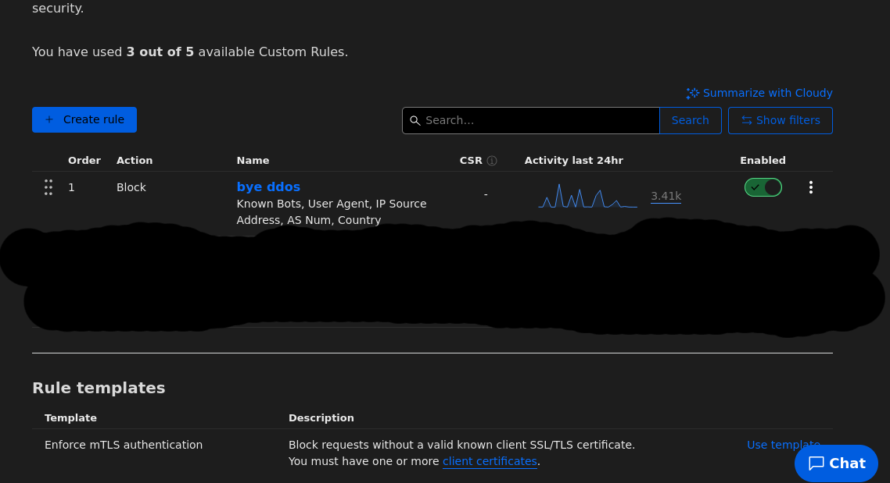

# Cloudflare-WAF-Rule
A Powerful Cloudflare WAF Anti DDoS rule I made that has even been tested by a real DDoS service and made with abusive servers attacking my site for preventing bots, VPNs/proxies, old browsers and cloud IPs from accessing your website.

## WAF Rule Details

The included items in my Cloudflare WAF rule is:

- Any bot detected by Cloudflare
- Chrome version 3-119
- Many cloud ASNs
- Many VPNs/proxies including TOR
- Path finders
- Firefox 3-119

### How to add the rule
- Before making the rule please make sure to turn off bot fight mode if it's on.
- Copy [this ruleset](https://cstuff.cz/Cloudflare-WAF-rule.txt) or one of the [mirrors](#Mirrors) and then paste it into the Cloudflare WAF rule you made.
- Now set the action to block, click deploy and then most DDoSes, users with proxies/VPNs, bots and cloud providers should be blocked.

## Mirrors
- [Mirror 1](https://raw.githubusercontent.com/SomeTechyGuy/Cloudflare-WAF-Rule/main/AntiDDos.txt)
- [Mirror 2](https://gitlab.com/cjhar1224/My-website/-/raw/main/public/Cloudflare-WAF-rule.txt)
- [Mirror 3](https://cdn.jsdelivr.net/gh/SomeTechyGuy/Cloudflare-WAF-Rule@main/AntiDDos.txt)
