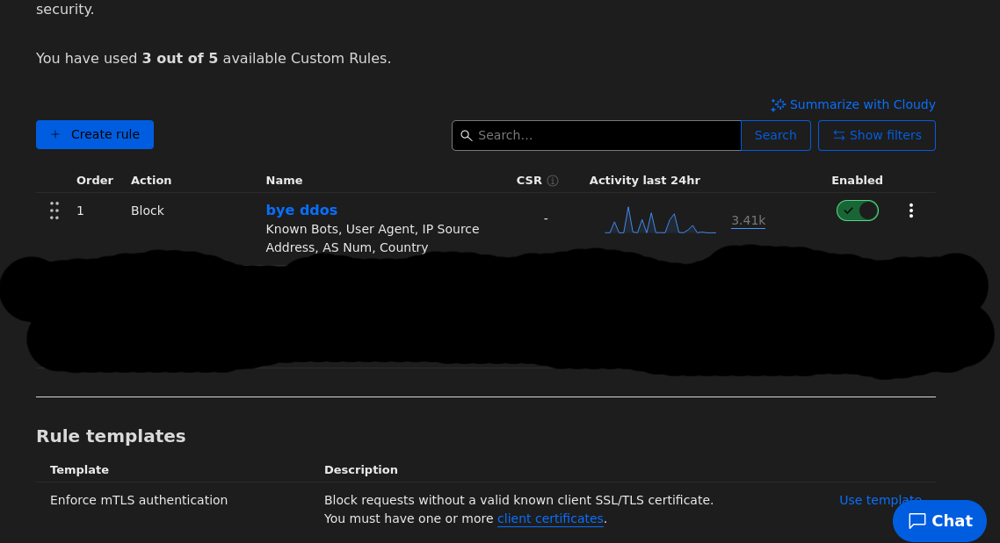

# DO NOT USE
This project is unmaintained, so these rule-sets might have false positives or just not block some bots.

If you for some reason still want more info about this repository, here is the old README:

# Cloudflare-WAF-Rule
A Powerful Cloudflare WAF Anti DDoS rule, which has been tested by a real DDoS service, and was made with abusive servers attacking my site.

## WAF Rule Details

The stuff blacklisted by the Cloudflare WAF rule is following:

- Any bot detected by Cloudflare
- Chrome useragents with version 3-119
- Many cloud ASNs
- Many VPNs/proxies (including TOR)
- Path scanners
- Firefox useragents with versions 3-119

### How to add the rule
- Turn off bot fight mode.
- Copy [this ruleset](https://raw.githubusercontent.com/SomeTechyGuy/Cloudflare-WAF-Rule/main/AntiDDos.txt) or one of the [mirrors](#Mirrors) and then paste it into the Cloudflare WAF rule.
- Now set the action to block, then click deploy.

## Mirrors
- [Mirror 1](https://gitlab.com/cjhar1224/My-website/-/raw/main/public/Cloudflare-WAF-rule.txt)
- [Mirror 2](https://cdn.jsdelivr.net/gh/SomeTechyGuy/Cloudflare-WAF-Rule@main/AntiDDos.txt)
